<p align="center">
  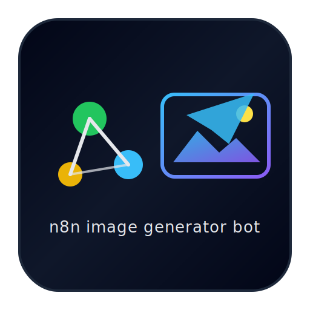
</p>

# n8n Image Generator Bot  
Telegram-бот на базе n8n и OpenAI (GPT + DALL·E 3)

[](https://openai.com)
[](https://n8n.io)
[](https://core.telegram.org/bots/api)
[](LICENSE)

Этот проект представляет собой полностью готовый Telegram-бот, который генерирует изображения по команде пользователя.  
Бот собирает текстовый запрос, передаёт его в OpenAI DALL·E 3, а затем отправляет готовую картинку обратно в чат.

---

## 📌 Возможности

- Генерация изображений по текстовому описанию  
- Поддержка команд `/start` и `/image`  
- Автоматическое определение действия пользователя  
- Корректная обработка ошибок и неподдерживаемых команд  
- Возможность простого расширения функционала  
- Стандартизированные настройки через ноды `Settings` и `PreProcessing`  
- Полная совместимость с самописными n8n-интеграциями

---

## 🛠 Используемые технологии

- **n8n** — визуальная автоматизация
- **OpenAI API** — GPT-4.1-Mini + DALL·E 3
- **Telegram Bot API**
- **JavaScript Expression внутри нод n8n**

---

## 📁 Структура проекта

```text
n8n-image-generator-bot/
├── docs/
│   ├── README.md
│   └── overview-ru.md
├── screenshots/
│   ├── workflow_overview.jpg
│   ├── examples/
│   │   ├── telegram_example_image.jpg
│   │   └── telegram_example_image1.jpg
│   └── n8n/
│       ├── generate_image_parameters.jpg
│       ├── merge_choose_branch.jpg
│       ├── message_model_options.jpg
│       ├── message_model_parameters.jpg
│       ├── message_model_prompt.jpg
│       ├── preprocessing_parameters.jpg
│       ├── send_photo_message.jpg
│       ├── send_text_message.jpg
│       ├── send_text_message_fallback.jpg
│       ├── settings_parameters.jpg
│       ├── switch_parameters.jpg
│       └── telegram_trigger_parameters.jpg
├── workflows/
│   └── image_generator_telegram_bot.json
├── .gitignore
├── LICENSE
└── README.md
```markdown

---

## 🖼 Основной рабочий процесс

### Общая схема workflow  
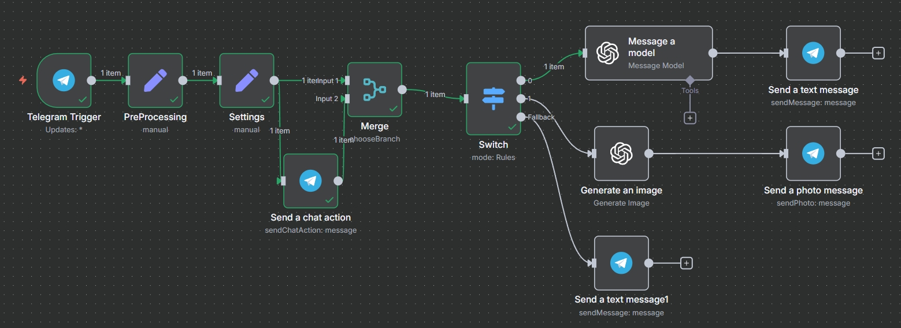

---

## 📸 Скриншоты работы бота

### Пример 1  


### Пример 2  


---

## 🧩 Скриншоты всех нод n8n

> Все параметры указаны точно так, как использованы в рабочем процессе.

### Telegram Trigger  
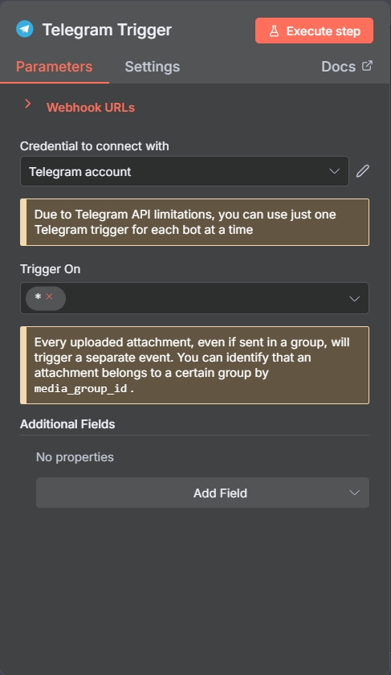

### Settings  


### PreProcessing  
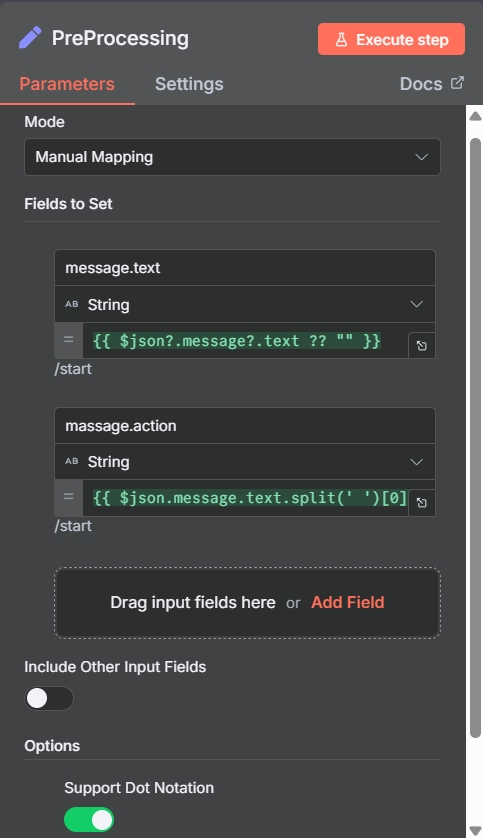

### Merge (Choose Branch)  
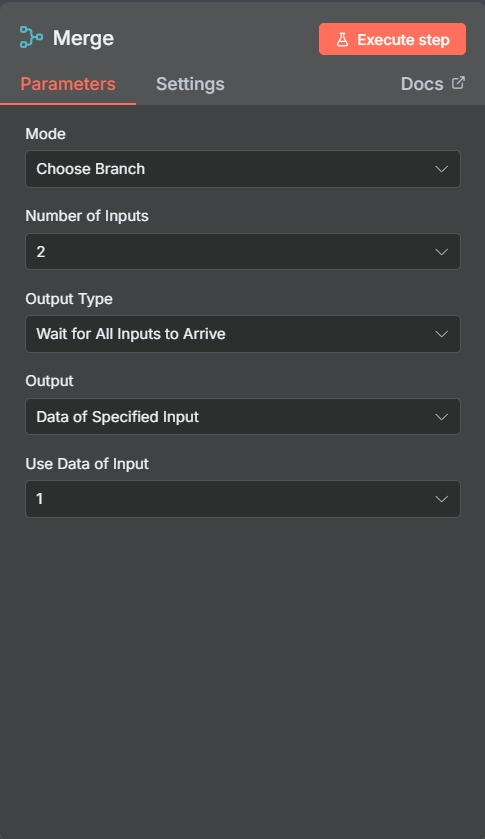

### Switch  
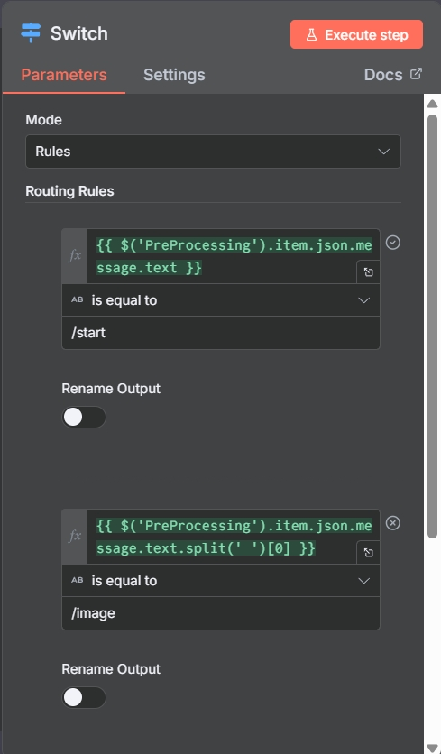

### Message Model — Parameters  
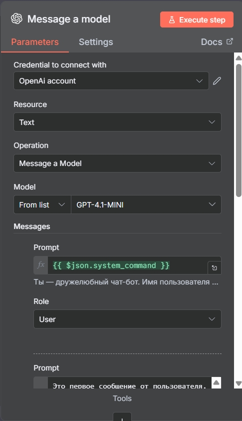

### Message Model — Options  
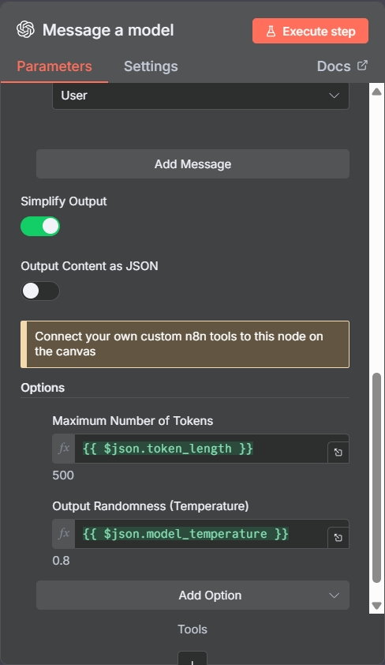

### Message Model — Prompt  
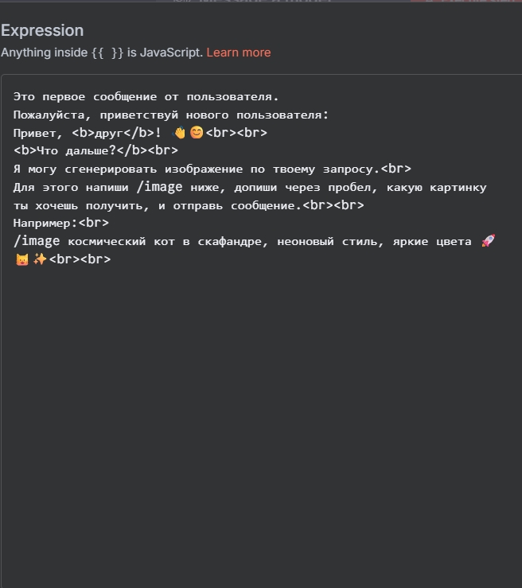

### Generate Image  
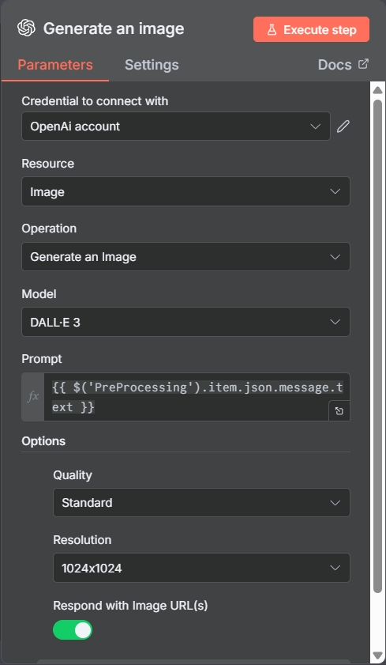

### Send Text Message  
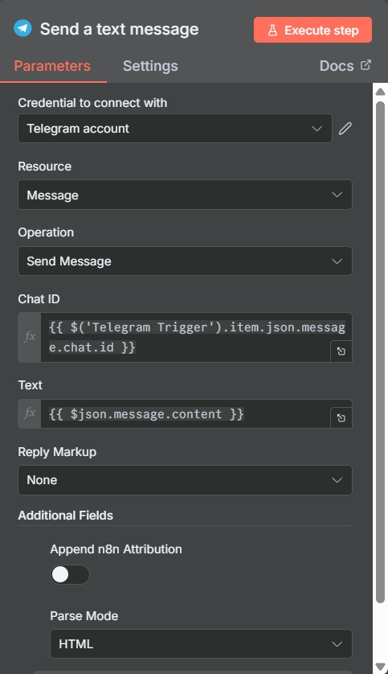

### Send Text Message (fallback)  
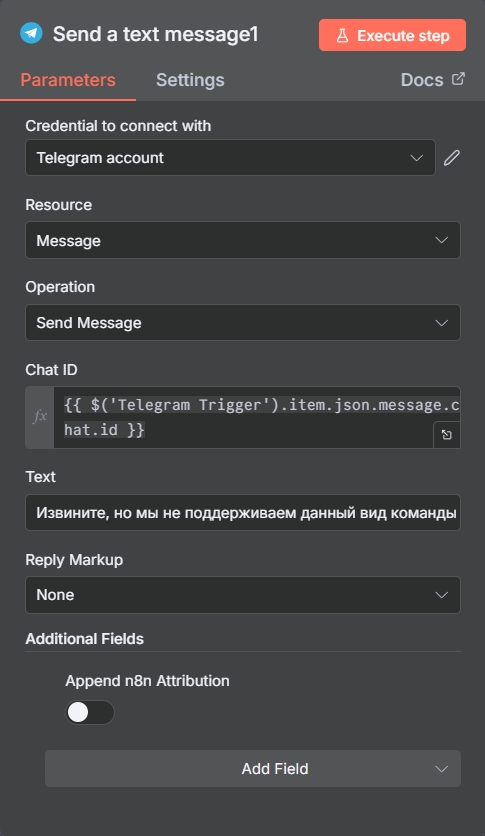

### Send Photo Message  
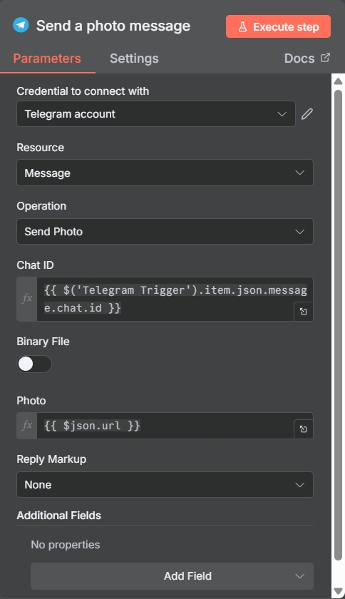

---

## 🚀 Установка и запуск

### 1. Импортируйте workflow в n8n  
Файл находится здесь:  

workflows/image_generator_telegram_bot.json

### 2. Настройте креды  
Вам потребуется:

- **Telegram API Key**  
- **OpenAI API Key**

### 3. Запустите workflow  
После активации бот автоматически начнёт отвечать на команды.

---

## 💬 Команды бота

### `/start`
Приветственное сообщение + инструкция по использованию.

### `/image <запрос>`
Генерация изображения по текстовому описанию.

---

## 📄 Документация

Полное русскоязычное описание:  
`docs/overview-ru.md`

---

## 📝 Лицензия

Проект распространяется под лицензией MIT.  
Вы можете свободно использовать, изменять и распространять его — при указании авторства.

---

## 🤝 Автор

**Evgenii Verkhoglyad (paracriptus-oss)**  
Эксперт по нейросетям, автоматизации и созданию AI-ботов.

---

# n8n Image Generator Bot  
Telegram bot powered by **n8n**, **GPT** and **DALL·E 3**

[](https://openai.com)
[](https://n8n.io)
[](https://core.telegram.org/bots/api)
[](LICENSE)

This project provides a fully functional Telegram bot that generates AI images from user prompts.  
It processes commands, sends requests to OpenAI’s **DALL·E 3**, and returns high-quality images directly in chat.

---

## 📌 Features

- Generate images using DALL·E 3 from natural language prompts  
- Command support: `/start` and `/image`  
- Smart text preprocessing and intent detection  
- Polished routing logic with proper error handling  
- Extensible architecture via n8n node chaining  
- Centralized bot configuration via `Settings` and `PreProcessing` nodes  
- Fully compatible with custom n8n JavaScript expressions

---

## 🛠 Tech Stack

- **n8n** — workflow automation  
- **OpenAI API** — GPT-4.1-Mini + DALL·E 3  
- **Telegram Bot API**  
- **JavaScript expressions under n8n nodes**

---

## 📁 Project Structure

```text
n8n-image-generator-bot/
├── docs/
│   ├── README.md
│   └── overview-ru.md
├── screenshots/
│   ├── workflow_overview.jpg
│   ├── examples/
│   │   ├── telegram_example_image.jpg
│   │   └── telegram_example_image1.jpg
│   └── n8n/
│       ├── generate_image_parameters.jpg
│       ├── merge_choose_branch.jpg
│       ├── message_model_options.jpg
│       ├── message_model_parameters.jpg
│       ├── message_model_prompt.jpg
│       ├── preprocessing_parameters.jpg
│       ├── send_photo_message.jpg
│       ├── send_text_message.jpg
│       ├── send_text_message_fallback.jpg
│       ├── settings_parameters.jpg
│       ├── switch_parameters.jpg
│       └── telegram_trigger_parameters.jpg
├── workflows/
│   └── image_generator_telegram_bot.json
├── .gitignore
├── LICENSE
└── README.md
```markdown

---

## 🖼 Workflow Overview

### Main Workflow Structure  


---

## 📸 Telegram Bot Examples

### Example 1  


### Example 2  


---

## 🧩 n8n Node Screenshots  
> All parameters and expressions reflect the actual working configuration.

### Telegram Trigger  


### Settings  


### PreProcessing  


### Merge (Choose Branch)  


### Switch  


### Message Model — Parameters  


### Message Model — Options  


### Message Model — Prompt  


### Generate Image  


### Send Text Message  


### Send Text Message (fallback)  


### Send Photo Message  


---

## 🚀 Installation & Setup

### 1. Import the workflow into n8n  
Use the JSON file located here:

workflows/image_generator_telegram_bot.json

### 2. Set up credentials  
You will need:

- **Telegram Bot Token**
- **OpenAI API Key**

### 3. Activate the workflow  
Once activated, the bot will immediately start responding to Telegram messages.

---

## 💬 Supported Commands

### `/start`
Sends a welcome message and usage hints.

### `/image <prompt>`
Generates an image based on user-provided description.

---

## 📄 Documentation

Russian full description:  
`docs/overview-ru.md`

---

## 📝 License

This project is licensed under the **MIT License**, allowing free use, modification, and distribution with attribution.

---

## 🤝 Author

**Evgenii Verkhoglyad (paracriptus-oss)**  
Expert in neural networks, automation, and AI-powered content tools.

---
